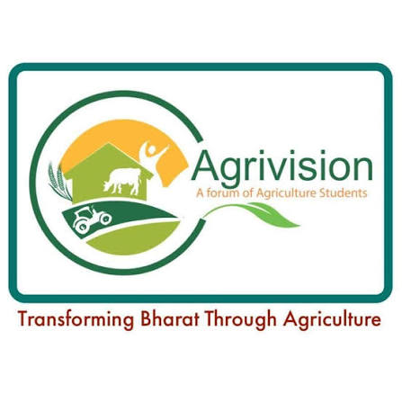
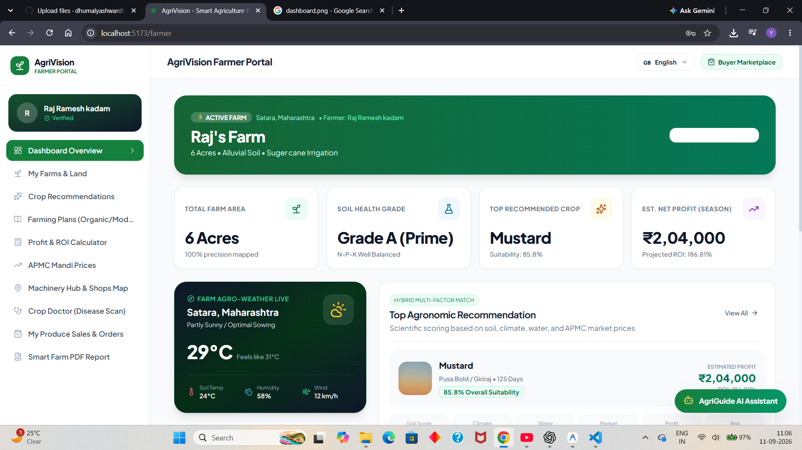
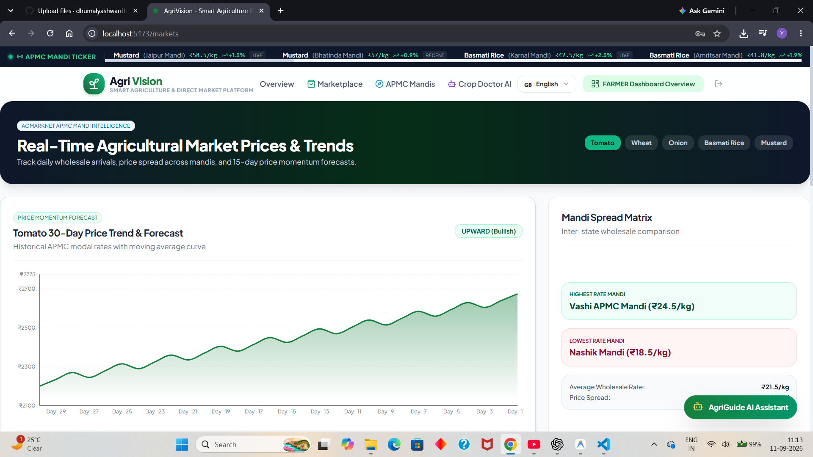
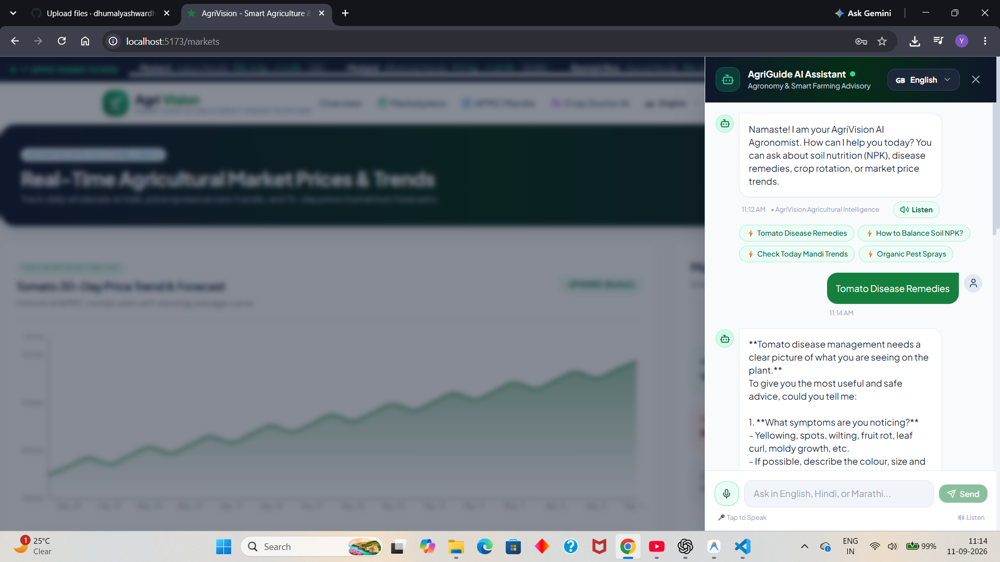
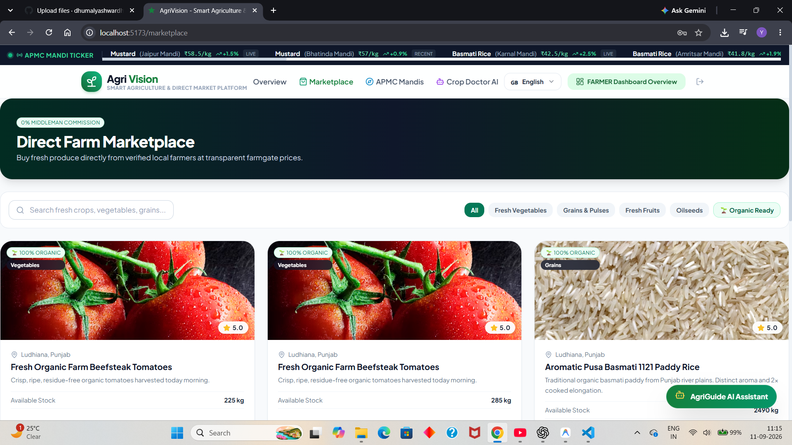

<div align="center">



<br>

# 🌱 AgriVision

### 🚜 Smart Agriculture & Direct Market Platform

### **Grow Smarter • Sell Better • Earn More**

<br>


<br>

> 🌾 **Empowering farmers with AI, market intelligence and modern digital technology.**

</div>

---

# 🌾 About AgriVision

**AgriVision** is a modern smart agriculture platform designed to help farmers manage farming information, understand agricultural markets, sell products directly, purchase farming products and receive AI-powered farming assistance.

It combines:

### 🌱 Agriculture + 🤖 Artificial Intelligence + 📊 Market Intelligence + 🛒 Digital Marketplace

into one powerful platform.

---

# 🎯 Our Mission

Our goal is simple:

> **Use technology to help farmers make smarter decisions and earn more.**

AgriVision aims to provide farmers with easy access to:

- 📊 Market prices
- 🌾 Farming information
- 🤖 AI assistance
- 🛒 Agricultural marketplace
- 📍 Location-based services
- 📦 Order management
- 🛍️ Agricultural products

---

# 🖥️ AgriVision Preview

<div align="center">

### 🏠 Smart Farmer Dashboard



<br><br>

### 📊 Market Intelligence



<br><br>

### 🤖 AI Farming Assistant



<br><br>

### 🛒 Farmer Marketplace



</div>

---

# 🚀 Powerful Features

<table>
<tr>
<td width="50%">

### 👨‍🌾 Farmer Profile

Store important farmer information including:

- Name
- Farm size
- Acreage
- State
- District
- Farming details

</td>

<td width="50%">

### 📊 Market Intelligence

Access useful agricultural market data:

- Commodity prices
- Market trends
- Price comparison
- State-wise data
- District-wise data

</td>
</tr>

<tr>
<td>

### 🤖 AI Farming Assistant

Ask agriculture-related questions and receive intelligent assistance for:

- Crops
- Farming
- Fertilizers
- Market information
- General agriculture queries

</td>

<td>

### 🛒 Farmer Marketplace

A digital platform where farmers can:

- List products
- Explore products
- Buy products
- Sell products
- Connect with the market

</td>
</tr>

<tr>
<td>

### 📍 Location-Based Services

Personalize the platform using the farmer's:

- State
- District
- Farming location
- Regional information

</td>

<td>

### 📦 Order Management

Manage agricultural transactions including:

- Orders
- Purchases
- Sales
- Order status

</td>
</tr>
</table>

---

# 🛍️ Agriculture Shop

AgriVision also provides access to farming-related products.

Farmers can explore products such as:

🌱 Seeds  
🧪 Fertilizers  
🚜 Farming equipment  
🛠️ Agricultural tools  
💧 Irrigation products  
🌾 Other farming essentials

---

# 🧩 Main Modules

```text
AgriVision
│
├── 🔐 Authentication
│
├── 👨‍🌾 Farmer Management
│
├── 📊 Market Intelligence
│
├── 🤖 AI Farming Assistant
│
├── 🛒 Marketplace
│
├── 🛍️ Agriculture Shop
│
├── 📦 Order Management
│
└── 📍 Location-Based Services

